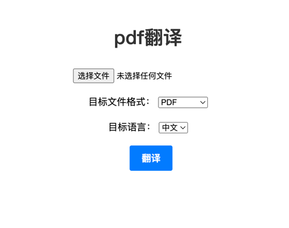

# OpenAI-Translator


### 环境准备

1.克隆仓库 `git clone https://github.com/bian-world/openai-translator.git`。

2.OpenAI-翻译器 需要 Python 3.10 或更高版本。使用 `pip install -r requirements.txt` 安装依赖项。

3.设置您的 OpenAI API 密钥(`$OPENAI_API_KEY`)或 ChatGLM 模型 URL(`$GLM_MODEL_URL`)。您可以将其添加到环境变量中，或者在 config.yaml 文件中指定。

4.安装前端依赖：node，http-server


然后命令行直接运行：

```bash
python backend/ai_translator/app.py

cd frontend; http-server

```
浏览器访问 http://127.0.0.1:8080



